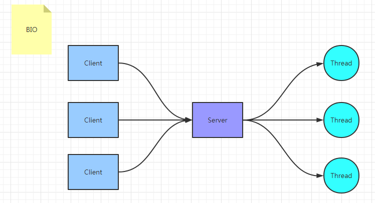
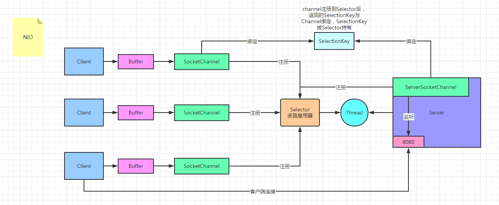

## BIO

同步阻塞模型， 一个客户端连接对应一个处理线程

**缺点**

- IO代码里read操作是阻塞操作，如果连接不做数据读写操作会导致线程阻塞，浪费资源 
-  如果线程很多，会导致服务器线程太多，压力太大 

**应用场景**

 BIO 方式适用于连接数目比较小且固定的架构， 这种方式对服务器资源要求比较高，  但程序简单易理解 

### 图解



### 代码

- Server

```java
public class BIOServer {

    public static void main(String[] args) throws IOException {
        ServerSocket serverSocket = new ServerSocket(8080);
        for (;;){
            System.out.println("等待客户端连接....");
            //此处阻塞
            Socket socket = serverSocket.accept();
            System.out.println("有客户端连接了");
            byte[] bytes = new byte[1024];
            //此处阻塞
            int len = socket.getInputStream().read(bytes);
            if (len != -1)
                System.out.println("接收到客户端的信息：" + new String(bytes, 0, len));
            System.out.println("向客户端发送一条信息...");
            socket.getOutputStream().write("Hello Client".getBytes());
            socket.getOutputStream().flush();
            System.out.println("信息已发送");
            socket.close();
        }
    }
}
```

- Client

```java
public class BIOClient {

    public static void main(String[] args) throws IOException {
        Socket socket = new Socket("127.0.0.1", 8080);
        System.out.println("准备向服务端发送信息....");
        socket.getOutputStream().write("Hello Server".getBytes());
        socket.getOutputStream().flush();
        System.out.println("信息发送完毕");
        byte[] bytes = new byte[1024];
        //此处阻塞
        int len = socket.getInputStream().read(bytes);
        if (len != -1)
            System.out.println("接收到服务端返回的信息：" + new String(bytes, 0, len));
        socket.close();
        System.out.println("连接结束");
    }
}
```

## NIO

 同步非阻塞，服务器实现模式为一个线程可以处理多个请求(连接)，客户端发送的连接请求都会注册到**多路复用器selector**上，多路复用器轮询到连接有IO请求就进行处理。 

I/O多路复用底层一般用的Linux API（select，poll，epoll）来实现，他们的区别如下表：

|              | select        | poll          | epoll(JDK 1.5及以上) |
| ------------ | ------------- | ------------- | -------------------- |
| **操作方式** | 遍历          | 遍历          | 回调                 |
| **底层实现** | 数组          | 链表          | 哈希表               |
| **IO效率**   | 线性遍历 O(n) | 线性遍历 O(n) | 事件通知方式O(1)     |
| **最大连接** | 有上限        | 无上限        | 无上限               |

> IO效率
>
> - select: 每次调用都进行线性遍历，时间复杂度为O(n)
> - poll: 每次调用都进行线性遍历，时间复杂度为O(n)
> - epoll:事件通知方式，每当有IO事件就绪，系统注册的回调函数就会被调用，时间复杂度O(1)

**应用场景：**

NIO方式适用于连接数目多且连接比较短（轻操作） 的架构， 比如聊天服务器， 弹幕系统， 服务器间通讯，编程比较复杂， JDK1.4 开始支持

>  NIO 有三大核心组件： **Channel(通道)， Buffer(缓冲区)，Selector(选择器)** 

### 图解



1、channel 类似于流，每个 channel 对应一个 buffer缓冲区，buffer 底层就是个数组

2、channel 会注册到 selector 上，由 selector 根据 channel 读写事件的发生将其交由某个空闲的线程处理

3、selector 可以对应一个或多个线程

4、NIO 的 Buffer 和 channel 都是既可以读也可以写

### 代码

- Server

``` java
public class NIOServer {
    public static void main(String[] args) throws IOException {
        ServerSocketChannel serverSocketChannel = ServerSocketChannel.open();
        //配置为非阻塞模式
        serverSocketChannel.configureBlocking(false);
        serverSocketChannel.socket().bind(new InetSocketAddress(8080));
        //创建一个多路复用器selector
        Selector selector = Selector.open();
        //将ServerSocketChannel注册到selector上,并且设置selector对客户端连接感兴趣
        serverSocketChannel.register(selector, SelectionKey.OP_ACCEPT);
        for(;;){
            System.out.println("等待事件发生....");
            //轮询selector的key,此处阻塞
            selector.select();
            System.out.println("有事件发生了");
            Iterator<SelectionKey> iterator = selector.selectedKeys().iterator();
            while (iterator.hasNext()) {
                SelectionKey selectionKey = iterator.next();
                //删除本次已处理的key，防止下次select重复处理
                iterator.remove();
                handle(selectionKey);
            }
        }
    }

    public static void handle(SelectionKey selectionKey) throws IOException {
        if(selectionKey.isAcceptable()){
            System.out.println("有客户端连接事件发生了");
            //由于此处为对accept感兴趣，只有ServerSocketChannel注册到selector上时是对accept感兴趣，
            //所以这里的channel是ServerSocketChannel
            ServerSocketChannel serverSocketChannel = (ServerSocketChannel) selectionKey.channel();
            //NIO非阻塞体现：此处accept方法是阻塞的，但是这里因为是发生了连接事件，所以这个方法会马上执行完，不会阻塞
            SocketChannel socketChannel = serverSocketChannel.accept();//同BIO返回一个连接客户端的channel(socket)
            //将SocketChannel配置为非阻塞，并且对read事件感兴趣
            socketChannel.configureBlocking(false);
            socketChannel.register(selectionKey.selector(), SelectionKey.OP_READ);
        }else if(selectionKey.isReadable()){
            System.out.println("有客户端数据可读事件发生了");
            //由于此处为对read感兴趣，只有SocketChannel注册到selector上时是对read感兴趣
            //所以这里的channel是SocketChannel
            SocketChannel channel = (SocketChannel) selectionKey.channel();
            //以下为读取客户端发送的数据与向客户端发送数据操作
            ByteBuffer byteBuffer = ByteBuffer.allocate(1024);
            //NIO非阻塞体现:首先read方法不会阻塞，其次这种事件响应模型，当调用到read方法时肯定是发生了客户端发送数据的事件
            int len = channel.read(byteBuffer);
            if(len != -1)
                System.out.println("接收到客户端的数据：" + new String(byteBuffer.array(), 0, len));
            ByteBuffer bufferToWrite = ByteBuffer.wrap("Hello Client".getBytes());
            channel.write(bufferToWrite);
        }
    }
}
```

- Client

```java
public class NIOClient {
    public static void main(String[] args) throws IOException {
        SocketChannel socketChannel = SocketChannel.open();
        socketChannel.configureBlocking(false);
        Selector selector = Selector.open();
        //此时客户端注册到selector,并且是对connect感兴趣
        socketChannel.register(selector, SelectionKey.OP_CONNECT);
        // 客户端连接服务器,其实方法执行并没有实现连接，需要调用channel.finishConnect()才能完成连接
        socketChannel.connect(new InetSocketAddress("127.0.0.1",8080));
        while (true){
            selector.select();
            Iterator<SelectionKey> iterator = selector.selectedKeys().iterator();
            while (iterator.hasNext()) {
                SelectionKey selectionKey = iterator.next();
                iterator.remove();
                if(selectionKey.isConnectable()){
                    SocketChannel channel = (SocketChannel) selectionKey.channel();
                    // 如果正在连接，则完成连接
                    if (channel.isConnectionPending()) {
                        channel.finishConnect();
                    }
                    ByteBuffer bufferToWrite = ByteBuffer.wrap("Hello Server".getBytes());
                    channel.write(bufferToWrite);
                    channel.configureBlocking(false);
                    channel.register(selector, SelectionKey.OP_READ);
                }else if(selectionKey.isReadable()){
                    SocketChannel channel = (SocketChannel) selectionKey.channel();
                    ByteBuffer byteBuffer = ByteBuffer.allocate(1024);
                    int len = channel.read(byteBuffer);
                    if(len != -1)
                        System.out.println("接收到服务端的数据：" + new String(byteBuffer.array(), 0, len));
                }
            }
        }
    }
}
```

## AIO

异步非阻塞， 由操作系统完成后回调通知服务端程序启动线程去处理。

**应用场景：**

AIO方式适用于连接数目多且连接比较长（重操作） 的架构，JDK7 开始支持

### 代码

- Server

```java
public class AIOServer {

    public static void main(String[] args) throws IOException, InterruptedException {
        final AsynchronousServerSocketChannel serverChannel =
                AsynchronousServerSocketChannel.open().bind(new InetSocketAddress(9000));

        serverChannel.accept(null, new CompletionHandler<AsynchronousSocketChannel, Object>() {
            @Override
            public void completed(AsynchronousSocketChannel socketChannel, Object attachment) {
                try {
                    // 再此接收客户端连接，如果不写这行代码后面的客户端连接不上服务端
                    serverChannel.accept(attachment, this);
                    System.out.println(socketChannel.getRemoteAddress());
                    ByteBuffer buffer = ByteBuffer.allocate(1024);
                    socketChannel.read(buffer, buffer, new CompletionHandler<Integer, ByteBuffer>() {
                        @Override
                        public void completed(Integer result, ByteBuffer buffer) {
                            buffer.flip();
                            System.out.println(new String(buffer.array(), 0, result));
                            socketChannel.write(ByteBuffer.wrap("HelloClient".getBytes()));
                        }

                        @Override
                        public void failed(Throwable exc, ByteBuffer buffer) {
                            exc.printStackTrace();
                        }
                    });
                } catch (IOException e) {
                    e.printStackTrace();
                }
            }

            @Override
            public void failed(Throwable exc, Object attachment) {
                exc.printStackTrace();
            }
        });

        Thread.sleep(Integer.MAX_VALUE);
    }
}
```

- Client

```java
public class AIOClient {

    public static void main(String... args) throws Exception {
        AsynchronousSocketChannel socketChannel = AsynchronousSocketChannel.open();
        socketChannel.connect(new InetSocketAddress("127.0.0.1", 9000)).get();
        socketChannel.write(ByteBuffer.wrap("HelloServer".getBytes()));
        ByteBuffer buffer = ByteBuffer.allocate(512);
        Integer len = socketChannel.read(buffer).get();
        if (len != -1) {
            System.out.println("客户端收到信息：" + new String(buffer.array(), 0, len));
        }
    }
}
```

## BIO&NIO&AIO对比

|              | **BIO**  | **NIO**    | **AIO**    |
| ------------ | -------- | ---------- | ---------- |
| **IO模型**   | 同步阻塞 | 同步非阻塞 | 异步非阻塞 |
| **编程难度** | 简单     | 复杂       | 复杂       |
| **可靠性**   | 差       | 好         | 好         |
| **吞吐量**   | 低       | 高         | 高         |

