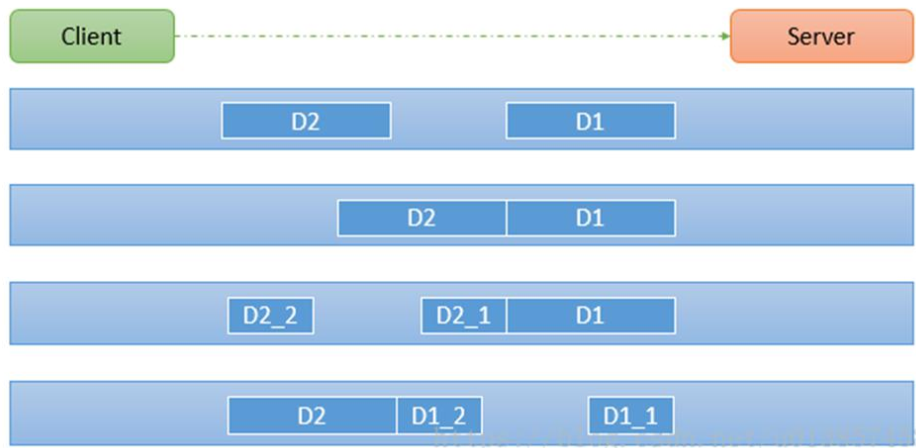

## 编解码

涉及编解码的组件主要有`Channel`，`ChannelPipeline`，`ChannelHandler`，他们之间的关系已在上篇文章[netty核心功能与线程模型](https://zijiancode.cn/archives/netty核心功能与线程模型)有详细说明，下面主要介绍他们在编解码中担任的角色。

- `Channel`: 一个 `Channel` 包含了一个` ChannelPipeline`，而 `ChannelPipeline` 中又维护了一个由 `ChannelHandlerContext` 组成的双向链表，并且每个` ChannelHandlerContext `中又关联着一个 `ChannelHandler`。 

- `ChannelHandler`: 充当处理入站和出站数据的应用程序逻辑容器 ,当实现` ChannelInboundHandler `接口时，便可以接收入站时的数据，对入站的数据进行处理，如解码操作。当实现`ChannelOutboundHandler`接口时，就可以处理出站时的数据，如编码操作。

  > 入站：数据从外部流入内部的过程，如接收请求。
  >
  > 出站：数据从内部向外部响应的过程，如响应请求。

- `ChannelPipeline`:里面维护着一个由`ChannelHandler`组成的双向链表，当处理入站事件时，将会依次调用`head`到`tail`中所有实现` ChannelInboundHandler `接口的`ChannelHandler`，当处理出站事件时，将会依次调用`tail`到`head`中所有实现`ChannelOutboundHandler`接口的`ChannelHandler`。

### 编解码器

`Netty`发送或接收消息时，通常需要进行数据转换，这便是一个编解码的过程，处理入站消息时需要解码，发送消息时需要编码。

`Netty`中常用的编解码器

- `StringEncoder&StringDecoder`:处理字符串类型的编码器与解码器
- `ObjectEncoder&ObjectDecoder`:处理对象类型的编码器与解码器
- `MessageToByteEncoder<T>`:抽象类，继承实现自定义编码器
- `ByteToMessageDecoder`:抽象，继承实现自定义解码器

### 代码案例

- Server

```java
public class NettyServer {

    public static void main(String[] args){
        EventLoopGroup bossGroup = new NioEventLoopGroup(1);
        EventLoopGroup workerGroup = new NioEventLoopGroup();
        try {
            ServerBootstrap serverBootstrap = new ServerBootstrap();
            serverBootstrap.group(bossGroup, workerGroup)
                    .channel(NioServerSocketChannel.class)
                    .childHandler(new ChannelInitializer<SocketChannel>() {

                        @Override
                        protected void initChannel(SocketChannel ch) throws Exception {
                            ChannelPipeline pipeline = ch.pipeline();
//                            pipeline.addLast(new StringDecoder());
//                            pipeline.addLast(new StringEncoder());
//                            pipeline.addLast(new ByteToLongDecoder()).addLast(new LongToByteEncoder());
                            pipeline.addLast(new ObjectDecoder(ClassResolvers.cacheDisabled(null)));
                            pipeline.addLast(new NettyServerHandler());
                        }
                    });
            System.out.println("netty server start。。");
            ChannelFuture channelFuture = serverBootstrap.bind(8080).sync();
            channelFuture.channel().closeFuture().sync();
        } catch (InterruptedException e) {
            e.printStackTrace();
        }finally {
            bossGroup.shutdownGracefully();
            workerGroup.shutdownGracefully();
        }
    }
}
```

- Server Handler

```java
public class NettyServerHandler extends ChannelInboundHandlerAdapter {

    @Override
    public void channelRead(ChannelHandlerContext ctx, Object msg) throws Exception {
        System.out.println("从客户端读取到数据：" + msg.toString());
//        ctx.writeAndFlush("Hello Client");
        //给客户端发回一个long数据
//        ctx.writeAndFlush(99999L);
    }

    @Override
    public void exceptionCaught(ChannelHandlerContext ctx, Throwable cause) throws Exception {
        cause.printStackTrace();
        ctx.close();
    }
}
```

- Client

```java
public class NettyClient {

    public static void main(String[] args) {
        EventLoopGroup group = new NioEventLoopGroup();
        try{
            Bootstrap bootstrap = new Bootstrap();
            bootstrap.group(group)
                    .channel(NioSocketChannel.class)
                    .handler(new ChannelInitializer<SocketChannel>() {
                        @Override
                        protected void initChannel(SocketChannel channel) throws Exception {
                            ChannelPipeline pipeline = channel.pipeline();
//                            pipeline.addLast(new StringDecoder());
//                            pipeline.addLast(new StringEncoder());
//                            pipeline.addLast(new ByteToLongDecoder()).addLast(new LongToByteEncoder());
                            pipeline.addLast(new ObjectEncoder());
                            pipeline.addLast(new NettyClientHandler());
                        }
                    });
            System.out.println("netty client start。。");
            ChannelFuture channelFuture = bootstrap.connect("127.0.0.1", 8080).sync();
            channelFuture.channel().closeFuture().sync();
        }catch (Exception e){

        }finally {
            group.shutdownGracefully();
        }
    }
}
```

- Client Handler

```java
public class NettyClientHandler extends ChannelInboundHandlerAdapter {
    @Override
    public void channelActive(ChannelHandlerContext ctx) throws Exception {
        System.out.println("MyClientHandler发送数据");
        //测试String编码
//        ctx.writeAndFlush("Hello Server");
        //测试自定义Long编码器
//        ctx.writeAndFlush(10000L);
        //测试Object编码
        ctx.writeAndFlush(new User("lzj",18));
    }

    @Override
    public void channelRead(ChannelHandlerContext ctx, Object msg) throws Exception {
        System.out.println("收到服务器消息:" + msg);
    }
}
```

- Long类型转字节

```java
public class LongToByteEncoder extends MessageToByteEncoder<Long> {
    @Override
    protected void encode(ChannelHandlerContext ctx, Long msg, ByteBuf out) throws Exception {
        System.out.println("call long to byte encode");
        out.writeLong(msg);
    }
}
```

- 字节转Long类型

```java
public class ByteToLongDecoder extends ByteToMessageDecoder {

    @Override
    protected void decode(ChannelHandlerContext ctx, ByteBuf in, List<Object> out) throws Exception {
        System.out.println("call byte to long decode!");
        out.add(in.readLong());
    }
}
```

- User

```java
public class User implements Serializable {

    private static final long serialVersionUID = -678718876097674957L;

    private String username;

    private int age;
    //GET && SET
}
```

## 粘包拆包

 TCP粘包拆包是指发送方发送的若干包数据到接收方接收时粘成一包或某个数据包被拆开接收。如下图所示，`client`发了两个数据包`D1`和`D2`，但是server端可能会收到如下几种情况的数据。 




**为什么出现粘包现象**

TCP 是面向连接的， 面向流的， 提供高可靠性服务。 收发两端（客户端和服务器端） 都要有成对的 socket，因此， 发送端为了将多个发给接收端的包， 更有效的发给对方， 使用了优化方法（Nagle 算法），将多次间隔较小且数据量小的数据， 合并成一个大的数据块， 然后进行封包。 这样做虽然提高了效率， 但是接收端就难于分辨出完整的数据包了， 因为面向流的通信是无消息保护边界的。

**解决方案**

发送长度：发送每条数据的时候，将数据的长度一并发送，比如可以选择每条数据的前4位是数据的长度，应用层处理时可以根据长度来判断每条数据的开始和结束

- 编码代码

```java
public class MyMessageEncoder extends MessageToByteEncoder<String> {

    @Override
    protected void encode(ChannelHandlerContext ctx, String msg, ByteBuf out) throws Exception {
        System.out.println("call MyMessageEncoder.encode");
        byte[] bytes = msg.getBytes(CharsetUtil.UTF_8);
        out.writeInt(bytes.length);
        out.writeBytes(bytes);
    }
}
```

- 解码代码

```java
public class MyMessageDecoder extends ByteToMessageDecoder {

    int length = 0;
    @Override
    protected void decode(ChannelHandlerContext ctx, ByteBuf in, List<Object> out) throws Exception {
        System.out.println("call MyMessageDecoder.decode");
        //先判断读的数据是否大于4,读出数据长度
        if (in.readableBytes() < 4) return;
        if (length == 0){
            length = in.readInt();
        }
        if (in.readableBytes() < length) {
            System.err.println("长度不够，继续等待");
            return;
        }
        byte[] bytes = new byte[length];
        in.readBytes(bytes);
        out.add(new String(bytes));
        length = 0;
    }
}
```

> `ChannelPipeline`中添加代码
>
> `pipeline.addLast(new MyMessageDecoder());`
>
> `pipeline.addLast(new MyMessageEncoder());`

## 心跳检测

- Server

```java
public class HeartBeatServer {

    public static void main(String[] args) throws Exception {
        EventLoopGroup boss = new NioEventLoopGroup();
        EventLoopGroup worker = new NioEventLoopGroup();
        try {
            ServerBootstrap bootstrap = new ServerBootstrap();
            bootstrap.group(boss, worker)
                    .channel(NioServerSocketChannel.class)
                    .childHandler(new ChannelInitializer<SocketChannel>() {
                        @Override
                        protected void initChannel(SocketChannel ch) throws Exception {
                            ChannelPipeline pipeline = ch.pipeline();
                            pipeline.addLast("decoder", new StringDecoder());
                            pipeline.addLast("encoder", new StringEncoder());
                            //IdleStateHandler的readerIdleTime参数指定超过3秒还没收到客户端的连接，
                            //会触发IdleStateEvent事件并且交给下一个handler处理，下一个handler必须
                            //实现userEventTriggered方法处理对应事件
                            pipeline.addLast(new IdleStateHandler(3, 0, 0, TimeUnit.SECONDS));
                            pipeline.addLast(new HeartBeatServerHandler());
                        }
                    });
            System.out.println("netty server start。。");
            ChannelFuture future = bootstrap.bind(9000).sync();
            future.channel().closeFuture().sync();
        } catch (Exception e) {
            e.printStackTrace();
        } finally {
            worker.shutdownGracefully();
            boss.shutdownGracefully();
        }
    }
}
```

- Server Handler

```java
public class HeartBeatServerHandler extends SimpleChannelInboundHandler<String> {

    int readIdleTimes = 0;

    @Override
    protected void channelRead0(ChannelHandlerContext ctx, String s) throws Exception {
        System.out.println(" ====== > [server] message received : " + s);
        if ("Heartbeat Packet".equals(s)) {
            ctx.channel().writeAndFlush("ok");
        } else {
            System.out.println(" 其他信息处理 ... ");
        }
    }

    @Override
    public void userEventTriggered(ChannelHandlerContext ctx, Object evt) throws Exception {
        IdleStateEvent event = (IdleStateEvent) evt;

        String eventType = null;
        switch (event.state()) {
            case READER_IDLE:
                eventType = "读空闲";
                readIdleTimes++; // 读空闲的计数加1
                break;
            case WRITER_IDLE:
                eventType = "写空闲";
                // 不处理
                break;
            case ALL_IDLE:
                eventType = "读写空闲";
                // 不处理
                break;
        }


        System.out.println(ctx.channel().remoteAddress() + "超时事件：" + eventType);
        if (readIdleTimes > 3) {
            System.out.println(" [server]读空闲超过3次，关闭连接，释放更多资源");
            ctx.channel().writeAndFlush("idle close");
            ctx.channel().close();
        }
    }

    @Override
    public void channelActive(ChannelHandlerContext ctx) throws Exception {
        System.err.println("=== " + ctx.channel().remoteAddress() + " is active ===");
    }
}
```

- Client

```java
public class HeartBeatClient {
    public static void main(String[] args) throws Exception {
        EventLoopGroup eventLoopGroup = new NioEventLoopGroup();
        try {
            Bootstrap bootstrap = new Bootstrap();
            bootstrap.group(eventLoopGroup).channel(NioSocketChannel.class)
                    .handler(new ChannelInitializer<SocketChannel>() {
                        @Override
                        protected void initChannel(SocketChannel ch) throws Exception {
                            ChannelPipeline pipeline = ch.pipeline();
                            pipeline.addLast("decoder", new StringDecoder());
                            pipeline.addLast("encoder", new StringEncoder());
                            pipeline.addLast(new HeartBeatClientHandler());
                        }
                    });

            System.out.println("netty client start。。");
            Channel channel = bootstrap.connect("127.0.0.1", 9000).sync().channel();
            String text = "Heartbeat Packet";
            Random random = new Random();
            while (channel.isActive()) {
                int num = random.nextInt(10);
                Thread.sleep(2 * 1000);
                channel.writeAndFlush(text);
            }
        } catch (Exception e) {
            e.printStackTrace();
        } finally {
            eventLoopGroup.shutdownGracefully();
        }
    }

    static class HeartBeatClientHandler extends SimpleChannelInboundHandler<String> {

        @Override
        protected void channelRead0(ChannelHandlerContext ctx, String msg) throws Exception {
            System.out.println(" client received :" + msg);
            if (msg != null && msg.equals("idle close")) {
                System.out.println(" 服务端关闭连接，客户端也关闭");
                ctx.channel().closeFuture();
            }
        }
    }
}
```


- 