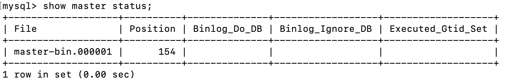

# MySQL集群搭建

MySQL是现在互联网最常用的开源数据库产品。但是我们平常开发使用，大都是用的单机服务。而在实际生产中，往往数据量会极为庞大，并且数据的安全性要求也更高，这样单机的MySQL，不管是性能还是安全都是达不到要求的。所以在生产环境中，MySQL必须是要搭建一套主从复制的架构，同时可以基于一些工具实现高可用架构。然后，在此基础上，就可以基于一些中间件实现读写分离架构。最后如果数据量非常大，还必须可以实现分库分表的架构。

环境: Ubuntu 18.04.3 LTS 两台

MySQL 版本：5.7.33

## 理论基础

### 主从架构有什么用？

通过搭建MySQL主从集群，可以缓解MySQL的数据存储以及访问的压力。

1. 数据安全

    给主服务增加一个数据备份。基于这个目的，可以搭建主从架构，或者也可以基于主从架构搭建互主的架构。

2. 读写分离

   对于大部分的JAVA业务系统来说，都是读多写少的，读请求远远高于写请求。这时，当主服务的访问压力过大时，可以将数据读请求转为由从服务来分担，主服务只负责数据写入的请求，这样大大缓解数据库的访问压力。但是，MySQL的主从架构只是实现读写分离的一个基础。实现读写分离还是需要一些中间件来支持，比如ShardingSphere。

3. 故障转移-高可用

    当MySQL主服务宕机后，可以由一台从服务切换成为主服务，继续提供数据读写功能。

    对于高可用架构，主从数据的同步也只是实现故障转移的一个前提条件，要实现MySQL主从切换，还需要依靠一些其他的中间件来实现。比如MMM、MHA、MGR。

> 在一般项目中，如果数据库的访问压力没有那么大，那读写分离不一定是必须要做的，但是，主从架构和高可用架构则是必须要搭建的。

### 同步原理

MySQL服务的主从架构一般都是通过binlog日志文件来进行的。即在主库上打开binlog记录每一步的数据库操作，然后从库上会有一个IO线程，负责跟主库建立一个TCP连接，请求主库将binlog传输过来。这时，主库上会有一个IO dump线程，负责通过这个TCP连接把Binlog日志传输给从库的IO线程。接着从库的IO线程会把读取到的binlog日志数据写入自己的relay日志文件中。然后从服务上另外一个SQL线程会读取relay日志里的内容，进行操作重演，达到还原数据的目的。


> MySQL的binlog不光可以用于主从同步，还可以用于缓存数据同步等场景。
>
> 例如Canal，可以模拟一个slave节点，向MySQL发起binlog同步，然后将数据落地到Redis、Kafka等其他组件，实现数据实时流转。

### 搭建要求

搭建主从集群时，有两个必要的要求：

- 双方MySQL必须版本一致，至少需要主服务的版本低于从服务。
- 两节点间的时间需要同步。

## 安装MySQL(Ubuntu)

参考文档：https://docs.rackspace.com/support/how-to/install-mysql-server-on-the-ubuntu-operating-system/

```shell
sudo apt-get update
sudo apt-get install mysql-server
#设置账号密码
sudo mysql_secure_installation utility
#开启自启
sudo systemctl enable mysql
#重启
sudo systemctl restart mysql
#连接mysql
mysql -uroot -p
```

## 设置主从

实例如下：

| ip           | 端口 | 节点类型 |
| ------------ | ---- | -------- |
| 192.168.1.13 | 3306 | 主节点   |
| 192.168.1.14 | 3306 | 从节点   |

### 1.修改主库MySQL配置

- 打开配置文件

  ```shell
  vim /etc/mysql/mysql.conf.d/mysqld.cnf
  ```

- 在[mysqld]条目下增加以下配置

  ```toml
  #服务id
  server-id=1 
  #开启binlog 
  log_bin=master-bin 
  log_bin-index=master-bin.index
  binlog_format=row
  #注释bind-address配置, 否则只能本机登陆mysql
  #bind-address=127.0.0.1
  ```

- 重启

  ```shell
  systemctl restart mysql
  ```

### 2. 创建新用户

在主库上创建一个新用户，用于数据同步

```mysql
CREATE USER 'slave'@'%' IDENTIFIED BY '1qaz@WSX0okm(IJN'; 
```

赋予同步权限

```mysql
GRANT REPLICATION SLAVE, REPLICATION CLIENT ON *.* TO 'slave'@'%';
FLUSH PRIVILEGES;
```

### 3. 修改从库MySQL配置

- 打开配置文件

  ```shell
  vim /etc/mysql/mysql.conf.d/mysqld.cnf
  ```

- 在[mysqld]条目下增加以下配置

  ```toml
  #服务id 需要和主库不一致
  server-id=2
  #打开MySQL中继日志 
  relay-log-index=slave-relay-bin.index 
  relay-log=slave-relay-bin
  #打开从服务二进制日志 
  log-bin=mysql-bin 
  #使得更新的数据写进二进制日志中 
  log-slave-updates=1
  ```

- 重启

  ```shell
  systemctl restart mysql
  ```

### 4. 配置主从

登陆主库

```shell
mysql -uroot -p
```

查询主库的同步状态

```mysql
show master status;
```



登陆从库，设置主库的同步状态

```mysql
#MASTER_LOG_FILE 和 MASTER_LOG_POS是主库状态的中的File和Position
CHANGE MASTER TO
MASTER_HOST='192.168.1.13',
MASTER_PORT=3306,
MASTER_USER='slave',
MASTER_PASSWORD='1qaz@WSX0okm(IJN',
MASTER_LOG_FILE='master-bin.000001',
MASTER_LOG_POS=154;

#开启slave 
start slave;
#查看主从同步状态
show slave status \G;
```


> `Slave_IO_Running` 和 `Slave_SQL_Running` 都为 Yes 则同步成功！

## 主从测试

在主库创建一个数据库

```mysql
create database demo;
```

查看从库的情况

```mysql
show databases;
+--------------------+
| Database           |
+--------------------+
| information_schema |
| demo               |
| mysql              |
| performance_schema |
| sys                |
+--------------------+
```

> 可以发现同步过来了

再创建一个表，并插入一条数据

```mysql
use demo;
create table demo_table (id int not null);
insert into demo_table values (1);
```

查看从库是否同步成功

```mysql
mysql> show tables;
+----------------+
| Tables_in_demo |
+----------------+
| demo_table     |
+----------------+
1 row in set (0.00 sec)

mysql> select * from demo_table;
+----+
| id |
+----+
|  1 |
+----+
1 row in set (0.00 sec)
```

## 集群搭建扩展

### 编写案例

首先，我们在主库中创建几个数据库和几张表用于测试。

```mysql
#创建一个不同步的库
create database ignore_db;
create database ignore_db_2;
#再在刚才的demo库中创建几张表
use demo;
create table ignore_table (id int not null);
```

### 部分同步

以上配置的主从同步都是针对全库的，而在实际环境中，我们一般只会针对一些特别重要的库或者表进行同步，修改方式如下。

#### 修改主库配置

- 打开配置文件

  ```shell
  vim /etc/mysql/mysql.conf.d/mysqld.cnf
  ```

- 在[mysqld]条目下增加以下配置

  ```toml
  #需要同步的二进制数据库名 
  binlog-do-db=demo 
  #只保留7天的二进制日志，以防磁盘被日志占满(可选) 
  expire-logs-days=7
  #不备份的数据库 
  binlog-ignore-db=ignore_db
  binlog-ignore-db=ignore_db_2
  ```

- 重启

  ```shell
  systemctl restart mysql
  ```

#### 修改从库配置

- 打开配置文件，配置从库与主库的对应关系

  ```shell
  vim /etc/mysql/mysql.conf.d/mysqld.cnf
  ```

- 在[mysqld]条目下增加以下配置

  ```toml
  #如果slave库名称与master库名相同，使用本配置 
  replicate-do-db=demo 
  #如果master库名[ignore_db]与slave库名[ignore_db2]不同，使用以下配置[需要做映射] 
  #当然，由于我这里的需要同步的只有一个demo库，也不需要映射关系，所以不做该配置，该配置只做为记录
  replicate-rewrite-db = ignore_db -> ignore_db2 
  #如果不是要全部同步[默认全部同步]，则指定需要同步的表 
  replicate-wild-do-table=demo.demo_table
  ```

- 重启

  ```shell
  systemctl restart mysql
  ```

#### 测试

往主库的demo数据库中的ignore_table表插入一条数据

```mysql
use demo;
insert into ignore_table values (1);
```

查询从库情况

```mysql
mysql> select * from ignore_table;
Empty set (0.00 sec)
```

> 可以发现从库未有任何记录添加，配置生效

在主库的ignore_db库中创建一张表

```mysql
use ignore_db;
create table test_table (id int not null);
```

查询从库情况

```mysql
mysql> use ignore_db;
Database changed
mysql> show tables;
Empty set (0.00 sec)
```

> 从库中无任何表新增，配置生效！

### 读写分离配置

在我们搭建的主从架构中，数据流向的单向的，只能由主库向从库同步，而从库的更新是无法同步到主库的。这便会造成一个问题：当不小心更新了从库，数据就会发现紊乱，最后导致数据不一致甚至同步发生错误导致中断。所以我们为了保证数据一致性需要在从库中加上以下配置：

```shell
vim /etc/mysql/mysql.conf.d/mysqld.cnf
#设置为只读
read_only=1
#重启服务
systemctl restart mysql
```

**注意：该配置只适用于普通用户，对于root等有super权限的用户无效！**

创建一个新用户进行测试

```mysql
CREATE USER 'test'@'%' IDENTIFIED BY '1qaz@WSX0okm(IJN';
#赋予所有表所有操作权限
GRANT INSERT,UPDATE,DELETE,SELECT ON *.* TO 'test'@'%';
FLUSH PRIVILEGES;
```

测试

```mysql
mysql> insert demo_table value (3);
ERROR 1290 (HY000): The MySQL server is running with the --read-only option so it cannot execute this statement
```

### GTID同步集群

以上搭建的集群方式，是基于Binlog日志记录点的方式来搭建的，这也是最为传统的MySQL集群搭建方式。而我们在`show master status`中可以看到有一个`Executed_Grid_Se`t列是空的。实际上，这就是另外一种搭建主从同步的方式，即`GTID`搭建方式。这种模式是从MySQL5.6版本引入的。

GTID的本质也是基于Binlog来实现主从同步，只是他会基于一个全局的事务ID来标识同步进度。GTID即全局事务ID，全局唯一并且趋势递增，他可以保证为每一个在主节点上提交的事务在复制集群中可以生成一个唯一的ID 。

在基于GTID的复制中，首先从服务器会告诉主服务器已经在从服务器执行完了哪些事务的GTID值，然后主库会有把所有没有在从库上执行的事务，发送到从库上进行执行，并且使用GTID的复制可以保证同一个事务只在指定的从库上执行一次，这样可以避免由于偏移量的问题造成数据不一致。

他的搭建方式跟我们上面的主从架构整体搭建方式差不多。只是需要修改一些配置。

#### 修改主库配置

```shell
vim /etc/mysql/mysql.conf.d/mysqld.cnf
gtid_mode=on
enforce_gtid_consistency=on
#重启服务
systemctl restart mysql
```

#### 修改从库配置

```shell
vim /etc/mysql/mysql.conf.d/mysqld.cnf
gtid_mode=on
enforce_gtid_consistency=on
#重启服务
systemctl restart mysql
```

```mysql
#关闭同步
stop slave;
#配置同步信息 使用MASTER_AUTO_POSITION自动获取同步信息
CHANGE MASTER TO
MASTER_HOST='192.168.1.13',
MASTER_PORT=3306,
MASTER_USER='slave',
MASTER_PASSWORD='1qaz@WSX0okm(IJN',
MASTER_AUTO_POSITION=1;
#开启同步
start slave;
#查看状态
show slave status\G
```

#### 查看主库状态

```mysql
mysql> show master status;
+-------------------+----------+--------------+----------------------+-------------------+
| File              | Position | Binlog_Do_DB | Binlog_Ignore_DB     | Executed_Gtid_Set |
+-------------------+----------+--------------+----------------------+-------------------+
| master-bin.000004 |      154 | demo         | ignore_db,ignore_db2 |                   |
+-------------------+----------+--------------+----------------------+-------------------+
```

> 咦，咋还是没有勒？

别急，因为该同步方式是基于事务id的，我们插入一条数据试试。

```mysql
insert into demo_table values (3);
```

查看状态

```myql
mysql> show master status;
+-------------------+----------+--------------+----------------------+------------------------------------------+
| File              | Position | Binlog_Do_DB | Binlog_Ignore_DB     | Executed_Gtid_Set                        |
+-------------------+----------+--------------+----------------------+------------------------------------------+
| master-bin.000004 |      676 | demo         | ignore_db,ignore_db2 | 7fb11262-7654-11eb-9930-0242c0296f15:1-2 |
+-------------------+----------+--------------+----------------------+------------------------------------------+
1 row in set (0.00 sec)
```

> 发现已生效！

## 加入新节点

### 安装MySQL并修改配置

- vim /etc/mysql/mysql.conf.d/mysqld.cnf

```toml
[mysqld]
server-id=3
relay-log-index=slave-relay-bin.index
relay-log=slave-relay-bin
log-bin=mysql-bin
log-slave-updates=1
gtid_mode=on
enforce_gtid_consistency=on
read_only=1
```

- 重启MySQL

```shell
systemctl restart mysql
```

### 配置主从

```shell
#登陆MySQL
mysql -uroot -p
#配置主从，由于我们使用gtid同步，所以不再需要查看master节点状态
CHANGE MASTER TO
MASTER_HOST='192.168.1.13',
MASTER_PORT=3306,
MASTER_USER='slave',
MASTER_PASSWORD='1qaz@WSX0okm(IJN',
MASTER_AUTO_POSITION=1;
#开启同步
start slave;
#查看状态
show slave status\G
```

### 问题解决

查看状态会发现以下错误

```
Got fatal error 1236 from master when reading data from binary log: 'The slave is connecting using CHANGE MASTER TO MASTER_AUTO_POSITION = 1, but the master has purged binary logs containing GTIDs that the slave requires. Replicate the missing transactions from elsewhere, or provision a new slave from backup. Consider increasing the master's binary log expiration period. The GTID set sent by the slave is '', and the missing transactions are '7fb11262-7654-11eb-9930-0242c0296f15:1-2'.'
```

> 看报错信息是因为我们清除了主库上的二进制文件，但我好像啥也没干

- 解决办法

  在主库上执行以下命令，查询gtid_purged，记录下该值

  ```mysql
  show global variables like '%gtid%'\G
  ```

  ```
  *************************** 1. row ***************************
  Variable_name: binlog_gtid_simple_recovery
          Value: ON
  *************************** 2. row ***************************
  Variable_name: enforce_gtid_consistency
          Value: ON
  *************************** 3. row ***************************
  Variable_name: gtid_executed
          Value: 7fb11262-7654-11eb-9930-0242c0296f15:1-2
  *************************** 4. row ***************************
  Variable_name: gtid_executed_compression_period
          Value: 1000
  *************************** 5. row ***************************
  Variable_name: gtid_mode
          Value: ON
  *************************** 6. row ***************************
  Variable_name: gtid_owned
          Value: 
  *************************** 7. row ***************************
  Variable_name: gtid_purged
          Value: 7fb11262-7654-11eb-9930-0242c0296f15:1-2
  *************************** 8. row ***************************
  Variable_name: session_track_gtids
          Value: OFF
  8 rows in set (0.00 sec)
  ```

- 在从库上同样执行该命令，记录`gtid_executed`值

  ```mysql
  show global variables like '%gtid%'\G
  ```

  ```
  *************************** 1. row ***************************
  Variable_name: binlog_gtid_simple_recovery
          Value: ON
  *************************** 2. row ***************************
  Variable_name: enforce_gtid_consistency
          Value: ON
  *************************** 3. row ***************************
  Variable_name: gtid_executed
          Value: 
  *************************** 4. row ***************************
  Variable_name: gtid_executed_compression_period
          Value: 1000
  *************************** 5. row ***************************
  Variable_name: gtid_mode
          Value: ON
  *************************** 6. row ***************************
  Variable_name: gtid_owned
          Value: 
  *************************** 7. row ***************************
  Variable_name: gtid_purged
          Value: 
  *************************** 8. row ***************************
  Variable_name: session_track_gtids
          Value: OFF
  8 rows in set (0.00 sec)
  ```

  > 咱这没有，就算了

- 重置从节点

  ```mysql
  stop slave;
  reset slave;
  #此时会将gtid_executed置空，因为我们这里本来就是空，如果有一定要置空，不然执行下面的命令将报错
  reset master;
  ```

- 设置清除的事务id

  ```mysql
  set @@global.gtid_purged='7fb11262-7654-11eb-9930-0242c0296f15:1-2';
  #再次查看
  show global variables like '%gtid%'\G
  #此时会发现gtid_purged多了我们加的事务id
  ```

  ```
  *************************** 1. row ***************************
  Variable_name: binlog_gtid_simple_recovery
          Value: ON
  *************************** 2. row ***************************
  Variable_name: enforce_gtid_consistency
          Value: ON
  *************************** 3. row ***************************
  Variable_name: gtid_executed
          Value: 7fb11262-7654-11eb-9930-0242c0296f15:1-2
  *************************** 4. row ***************************
  Variable_name: gtid_executed_compression_period
          Value: 1000
  *************************** 5. row ***************************
  Variable_name: gtid_mode
          Value: ON
  *************************** 6. row ***************************
  Variable_name: gtid_owned
          Value: 
  *************************** 7. row ***************************
  Variable_name: gtid_purged
          Value: 7fb11262-7654-11eb-9930-0242c0296f15:1-2
  *************************** 8. row ***************************
  Variable_name: session_track_gtids
          Value: OFF
  8 rows in set (0.00 sec)
  ```

- 重新开启同步

  ```mysql
  CHANGE MASTER TO
  MASTER_HOST='192.168.1.13',
  MASTER_PORT=3306,
  MASTER_USER='slave',
  MASTER_PASSWORD='1qaz@WSX0okm(IJN',
  MASTER_AUTO_POSITION=1;
  #开启同步
  start slave;
  #查看状态
  show slave status\G
  ```

## 复制机制

以上我们已经搭建了1主2从的集群，但是仍然会有一个隐患，那就是我们常说的数据丢失问题

这是因为MySQL主从集群默认采用的是一种异步复制的机制。主服务在执行用户提交的事务后，写入binlog日志，然后就给客户端返回一个成功的响应了。而binlog会由一个dump线程异步发送给从服务。


> 由于这个发送binlog的过程是异步的。主服务在向客户端反馈执行结果时，是不知道binlog是否同步成功了的。这时候如果主服务宕机了，而从服务还没有备份到新执行的binlog，那就有可能会丢数据。

这时，半同步复制机制就要登场啦

### 半同步复制

半同步复制机制是一种介于异步复制和全同步复制之前的机制。主库在执行完客户端提交的事务后，并不是立即返回客户端响应，而是等待至少一个从库接收并写到relay log中，才会返回给客户端。MySQL在等待确认时，默认会等10秒，如果超过10秒没有收到ack，就会降级成为异步复制。


优点：相比异步复制，能够有效的提高数据的安全性。

缺点：会造成一定程度的延迟，这个延迟时间最少是一个TCP/IP请求往返的时间。整个服务的性能是会有所下降的。而当从服务出现问题时，主服务需要等待的时间就会更长，要等到从服务的服务恢复或者请求超时才能给用户响应。

#### 配置半同步

- 安装扩展模块

  查看扩展模块文件，一般是在`/usr/lib/mysql/plugin`目录下

  ```shell
  ls /usr/lib/mysql/plugin
  adt_null.so     connection_control.so  keyring_file.so  locking_service.so  mysql_no_login.so  semisync_master.so  validate_password.so
  auth_socket.so  innodb_engine.so       libmemcached.so  mypluglib.so        rewriter.so        semisync_slave.so   version_token.so
  ```

  > 会看到有两个扩展模块`semisync_master.so` 和 `semisync_slave.so `

  登陆主节点安装`semisync_master.so`

  ```mysql
  -- 安装扩展模块
  mysql> install plugin rpl_semi_sync_master soname 'semisync_master.so';
  Query OK, 0 rows affected (0.17 sec)
  
  mysql> show global variables like 'rpl_semi%';
  +-------------------------------------------+------------+
  | Variable_name                             | Value      |
  +-------------------------------------------+------------+
  | rpl_semi_sync_master_enabled              | OFF        |
  | rpl_semi_sync_master_timeout              | 10000      |
  | rpl_semi_sync_master_trace_level          | 32         |
  | rpl_semi_sync_master_wait_for_slave_count | 1          |
  | rpl_semi_sync_master_wait_no_slave        | ON         |
  | rpl_semi_sync_master_wait_point           | AFTER_SYNC |
  +-------------------------------------------+------------+
  6 rows in set (0.00 sec)
  # 打开半同步
  mysql> set global rpl_semi_sync_master_enabled=ON;
  Query OK, 0 rows affected (0.00 sec)
  ```

  > rpl_semi_sync_master_enabled: 开启半同步
  >
  > rpl_semi_sync_master_timeout：应答时间，单位毫秒，这里是10s
  >
  > rpl_semi_sync_master_trace_level: 输出监控信息的级别
  >
  > rpl_semi_sync_master_wait_for_slave_count: 等待的从库数量
  >
  > rpl_semi_sync_master_wait_no_slave: 开启后从库同步跟上主库时，自动切换到同步模式
  >
  > rpl_semi_sync_master_wait_point: 同步方式
  >
  > AFTER_SYNC：默认方式，这种方式下，主库把日志写入binlog，并且复制给从库，然后开始等待从库的响应。从库返回成功后，主库再提交事务，接着给客户端返回一个成功响应。
  >
  > AFTER_COMMIT：在主库写入binlog后，发送binlog复制到从库，主库就提交自己的本地事务，再等待从库返回给自己一个成功响应，然后主库再给客户端返回响应，由于主库并未等待从库同步成功就已经提交了事务，所以会造成其他会员能在主库上看到数据，在从库上却看不到数据的情况(数据不一致)。

  登陆从库安装扩展模块`semisync_slave.so`

  ```mysql
  mysql> install plugin rpl_semi_sync_slave soname 'semisync_slave.so';
  Query OK, 0 rows affected (0.02 sec)
  
  mysql> show global variables like 'rpl_semi%';
  +---------------------------------+-------+
  | Variable_name                   | Value |
  +---------------------------------+-------+
  | rpl_semi_sync_slave_enabled     | OFF   |
  | rpl_semi_sync_slave_trace_level | 32    |
  +---------------------------------+-------+
  2 rows in set (0.02 sec)
  
  mysql> set global rpl_semi_sync_slave_enabled = on;
  Query OK, 0 rows affected (0.00 sec)
  
  mysql> show global variables like 'rpl_semi%';
  +---------------------------------+-------+
  | Variable_name                   | Value |
  +---------------------------------+-------+
  | rpl_semi_sync_slave_enabled     | ON    |
  | rpl_semi_sync_slave_trace_level | 32    |
  +---------------------------------+-------+
  2 rows in set (0.00 sec)
  -- 重新启动
  mysql> stop slave;
  Query OK, 0 rows affected (0.00 sec)
  
  mysql> start slave;
  Query OK, 0 rows affected (0.00 sec)
  ```

- 查看同步状态

  登陆主节点查看

  ```mysql
  SHOW STATUS LIKE '%semi%';
  +--------------------------------------------+-------+
  | Variable_name                              | Value |
  +--------------------------------------------+-------+
  | Rpl_semi_sync_master_clients               | 2     | 半同步复制客户端的个数
  | Rpl_semi_sync_master_net_avg_wait_time     | 0     | 平均等待时间，毫秒
  | Rpl_semi_sync_master_net_wait_time         | 0     | 总共等待时间
  | Rpl_semi_sync_master_net_waits             | 2     | 等待次数
  | Rpl_semi_sync_master_no_times              | 0     | 关闭半同步复制的次数
  | Rpl_semi_sync_master_no_tx                 | 0     | 没有成功接收slave提交的次数
  | Rpl_semi_sync_master_status                | ON    | 异步模式还是半同步模式，ON为半同步
  | Rpl_semi_sync_master_timefunc_failures     | 0     | 调用时间函数失败的次数
  | Rpl_semi_sync_master_tx_avg_wait_time      | 381   | 事务的平均传输时间
  | Rpl_semi_sync_master_tx_wait_time          | 381   | 事务的总共传输时间
  | Rpl_semi_sync_master_tx_waits              | 1     | 事物等待次数
  | Rpl_semi_sync_master_wait_pos_backtraverse | 0     | 后来的先到了，而先来的还没有到的次数
  | Rpl_semi_sync_master_wait_sessions         | 0     | 有多少个session因为slave的回复而造成等待
  | Rpl_semi_sync_master_yes_tx                | 1     | 成功接受到slave事务回复的次数
  +--------------------------------------------+-------+
  14 rows in set (0.00 sec)
  ```

## 数据延迟问题

在我们搭建的这个主从集群中，有一个比较隐藏的问题，就是这样的主从复制之间会有延迟。这在做了读写分离后，会更容易体现出来。即数据往主服务写，而读数据在从服务读。这时候这个主从复制延迟就有可能造成刚插入了数据但是查不到。

出现这个问题的根本在于：面向业务的主服务数据都是多线程并发写入的，而从服务是单个线程慢慢拉取binlog，这中间就会有个效率差。所以解决这个问题的关键是要让从服务也用多线程并行复制binlog数据。

登陆从节点修改配置

```mysql
#停止同步
mysql> stop slave;
Query OK, 0 rows affected (0.00 sec)
mysql>  show global variables like 'slave_parallel_workers%';
+------------------------+-------+
| Variable_name          | Value |
+------------------------+-------+
| slave_parallel_workers | 0     |
+------------------------+-------+
1 row in set (0.00 sec)
mysql> set global slave_parallel_workers = 4;
mysql> show global variables like 'slave_parallel_type%';
-- 默认是基于数据库的同步，即不同db下的操作可以在从库并行回放
+---------------------+----------+
| Variable_name       | Value    |
+---------------------+----------+
| slave_parallel_type | DATABASE |
+---------------------+----------+
1 row in set (0.00 sec)
-- LOGICAL_CLOCK方式，在主库对一个db或一张表并发执行的事务到slave端也可以并行回放
mysql> set global slave_parallel_type = LOGICAL_CLOCK;
mysql> start slave;
mysql> show processlist;
+----+-------------+-----------+------+---------+------+--------------------------------------------------------+------------------+
| Id | User        | Host      | db   | Command | Time | State                                                  | Info             |
+----+-------------+-----------+------+---------+------+--------------------------------------------------------+------------------+
|  8 | root        | localhost | demo | Query   |    0 | starting                                               | show processlist |
| 11 | system user |           | NULL | Connect |    7 | Waiting for master to send event                       | NULL             |
| 12 | system user |           | NULL | Connect |    7 | Slave has read all relay log; waiting for more updates | NULL             |
| 13 | system user |           | NULL | Connect |    7 | Waiting for an event from Coordinator                  | NULL             |
| 14 | system user |           | NULL | Connect |    7 | Waiting for an event from Coordinator                  | NULL             |
| 15 | system user |           | NULL | Connect |    7 | Waiting for an event from Coordinator                  | NULL             |
| 16 | system user |           | NULL | Connect |    7 | Waiting for an event from Coordinator                  | NULL             |
+----+-------------+-----------+------+---------+------+--------------------------------------------------------+------------------+
```

> 可以看到现在已经有4个同步线程了

