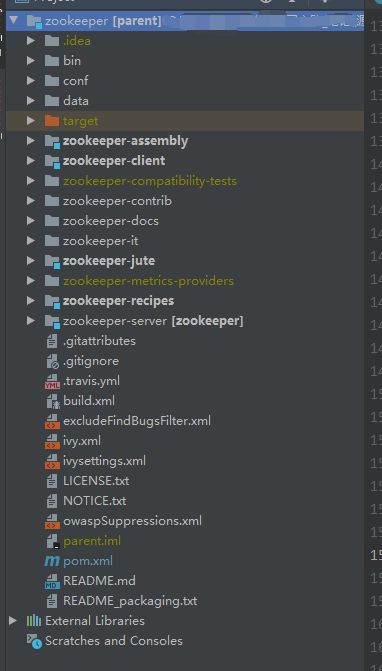
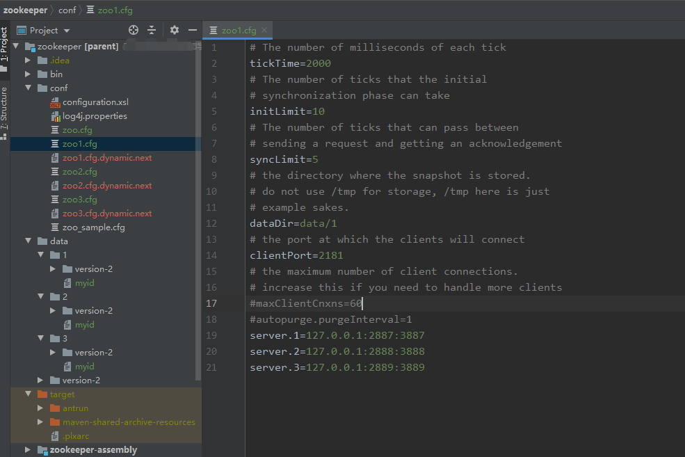

## 源码构建

源码地址：[https://github.com/apache/zookeeper ]( https://github.com/apache/zookeeper )

1. 使用git clone 源码
2. 选择分支，我这里选择的是3.5.5分支

源码结构如图：



* zookeeper-recipes: 示例源码
* zookeeper-client: C语言客户端
* zookeeper-server：主体源码

3. 刚打开时会发现缺少一大堆的类，根据README.md文件中的说明，我们首先需要先在根目录maven clean + install一次

4. 此时我们所需要的类就会生成到各个项目的target中，但是还是会少一个类`org.apache.zookeeper.version.Info`

   在包路径下新增类，发布版本时用的，对我们来说没啥用

   ```java
   package org.apache.zookeeper.version;
   
   public interface Info {
       int MAJOR=3;
       int MINOR=5;
       int MICRO=5;
       String QUALIFIER=null;
       int REVISION=-1; //TODO: remove as related to SVN VCS
       String REVISION_HASH="390fe37ea45dee01bf87dc1c042b5e3dcce88653";
       String BUILD_DATE="08/27/2020 03:28 GMT";
   }
   ```

5. 打开bin目录下的脚本文件，找到启动类，分别为

   - 客户端：`org.apache.zookeeper.ZooKeeperMain`
   - 服务端：
     - 单机启动：`org.apache.zookeeper.server.ZooKeeperServerMain`
     - 集群启动：`org.apache.zookeeper.server.quorum.QuorumPeerMain`

6. 此时启动是起不起来的，会报缺少配置文件的错，conf文件下编写配置文件

   - zoo.cfg

     ```properties
     tickTime=2000
     initLimit=10
     syncLimit=5
     dataDir=data
     clientPort=2181
     ```

7. 配置服务启动类的arg参数,`Program arguments`中填写配置文件的绝对路径，如：`D:\zookeeper\conf\zoo.cfg`

8. 启动单机Zookeeper服务端

9. 接下来尝试启动集群模式的Zookeeper,同样需要编写三份zoo.cfg，并且在数据卷路径下编写myid文件

   

10. 将配置文件地址配到`Program arguments`栏中，启动`QuorumPeerMain`
11. 启动客户端，客户端默认连接本机2181端口号，在参数栏中指定 server ip:port 可指定连接地址


## 源码解析

- 加载配置
- 开启清理旧日志线程
- 初始化对外服务（NIO 或 Netty)
- 初始化会话管理
- 将日志和快照文件的数据加载到内存中
- 启动NIO|Netty
- 开始选举

