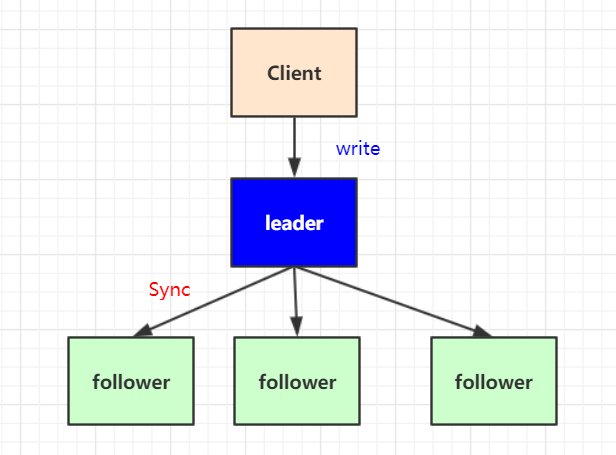

Zookeeper集群的目的是为了保证系统的性能承载更多的客户端连接设专门提供的机制。通过集群可以实现以下功能：

* 读写分离：提高承载，为更多的客户端提供连接，并保障性能。
* 主从自动切换：提高服务容错性，部分节点故障不会影响整个服务集群。

**半数以上运行机制说明：**
集群至少需要三台服务器，并且强烈建议使用奇数个服务器。因为Zookeeper 通过判断大多数节点的存活来判断整个服务是否可用。比如3个节点，挂掉了2个表示整个集群挂掉，而用偶数4个，挂掉了2个也表示其并不是大部分存活，因此也会挂掉。

## Zookeeper 集群搭建

- 使用三台服务器作为三个节点进行部署，分别为：

```properties
172.20.140.111
172.20.140.220
172.20.140.28
```

- 每台服务器的zookeeper路径为：

```shell
/usr/local/soft/apache-zookeeper-3.5.8-bin
```

- 为每个zookeeper编写zoo.cfg文件：

```properties
# The number of milliseconds of each tick
tickTime=2000
# The number of ticks that the initial 
# synchronization phase can take
initLimit=10
# The number of ticks that can pass between 
# sending a request and getting an acknowledgement
syncLimit=5
# the directory where the snapshot is stored.
# do not use /tmp for storage, /tmp here is just 
# example sakes.
dataDir=/usr/local/data/zookeeper
# the port at which the clients will connect
clientPort=2181
server.1=172.20.140.111:2888:3888
server.2=172.20.140.220:2888:3888
server.3=172.20.140.28:2888:3888
```

> server.<节点id> = ip : <数据同步端口> : <选举端口> 
>
> server.1 表示节点id为1的服务地址
>
> <节点id>: 服务id手动指定1至125之间的数字，并写到对应服务节点的 {dataDir}/myid 文件中

- 进入到zookeeper的数据卷目录，为每个zookeeper编写各自的id文件

server.1 服务器

```shell
cd /usr/local/data/zookeeper
vim myid
1
cat myid
1
```

server.2 服务器

```shell
cd /usr/local/data/zookeeper
vim myid
2
cat myid
2
```

server.3 服务器

```shell
cd /usr/local/data/zookeeper
vim myid
3
cat myid
3
```

- 分别启动

```shell
./bin/zkServer.sh start
```

- 查看状态

```shell
./bin/zkServer.sh status

ZooKeeper JMX enabled by default
Using config: /usr/local/soft/apache-zookeeper-3.5.8-bin/bin/../conf/zoo.cfg
Client port found: 2181. Client address: localhost.
Mode: follower
```

- happy time

```shell
./bin/zkCli.sh
```

### 集群角色说明

zookeeper 集群中总共有三种角色，分别是leader（主节点）follower(子节点) observer（次级子节点）

| 角色         | 描述                                                         |
| :----------- | :----------------------------------------------------------- |
| **leader**   | 主节点，又名领导者。用于写入数据，通过选举产生，如果宕机将会选举新的主节点。 |
| **follower** | 子节点，又名追随者。用于实现数据的读取。同时他也是主节点的备选节点，并用拥有投票权。 |
| **observer** | 次级子节点，又名观察者。用于读取数据，与fllower区别在于没有投票权，不能选为主节点。并且在计算集群可用状态时不会将observer计算入内。 |

## Zookeeper 选举机制

通过`bin/zkServer status`可查看节点的状态

**投票机制说明：**

第一次启动，没有zxid的情况

第一轮投票全部投给自己
第二轮投票给myid比自己大的节点
如果得票超过半数，选举结束。

有zxid的情况，投票给zxid最大的节点

**选举触发：**
当集群中的服务器出现已下两种情况时会进行Leader的选举

1. 服务节点初始化启动
2. 半数以上的节点无法和Leader建立连接

当节点初始起动时会在集群中寻找Leader节点，如果找到则与Leader建立连接，其自身状态变化**follower**或**observer。**如果没有找到Leader，当前节点状态将变化LOOKING，进入选举流程。
在集群运行其间如果有follower或observer节点宕机只要不超过半数并不会影响整个集群服务的正常运行。但如果leader宕机，将暂停对外服务，所有follower将进入LOOKING 状态，进入选举流程。

1. 数据同步机制

zookeeper 的数据同步是为了保证各节点中数据的一至性，同步时涉及两个流程，一个是正常的客户端数据提交，另一个是集群某个节点宕机在恢复后的数据同步。

**客户端写入请求：**

写入请求的大至流程是，收leader接收客户端写请求，并同步给各个子节点。如下图：

但实际情况要复杂的多，比如client 它并不知道哪个节点是leader 有可能写的请求会发给follower ，由follower在转发给leader进行同步处理


客户端写入流程说明：

1. client向zk中的server发送写请求，如果该server不是leader，则会将该写请求转发给leader server，leader将请求事务以proposal形式分发给follower；
2. 当follower收到收到leader的proposal时，根据接收的先后顺序处理proposal；
3. 当Leader收到follower针对某个proposal过半的ack后，则发起事务提交，重新发起一个commit的proposal
4. Follower收到commit的proposal后，记录事务提交，并把数据更新到内存数据库；
5. 当写成功后，反馈给client。

**服务节点初始化同步：**
在集群运行过程当中如果有一个follower节点宕机，由于宕机节点没过半，集群仍然能正常服务。当leader 收到新的客户端请求，此时无法同步给宕机的节点。造成数据不一至。为了解决这个问题，当节点启动时，第一件事情就是找当前的Leader，比对数据是否一至。不一至则开始同步,同步完成之后在进行对外提供服务。
如何比对Leader的数据版本呢，这里通过ZXID事物ID来确认。比Leader小就需要同步。
**ZXID说明：**
ZXID是一个长度64位的数字，其中低32位是按照数字递增，任何数据的变更都会导致,低32位的数字简单加1。高32位是leader周期编号，每当选举出一个新的leader时，新的leader就从本地事物日志中取出ZXID,然后解析出高32位的周期编号，进行加1，再将低32位的全部设置为0。这样就保证了每次新选举的leader后，保证了ZXID的唯一性而且是保证递增的。 

